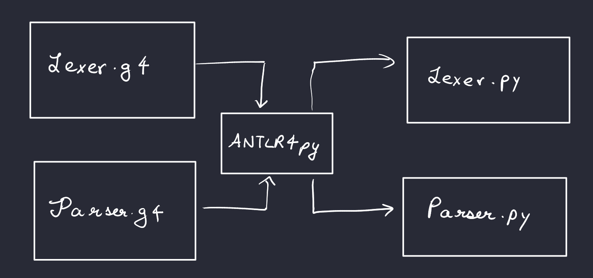
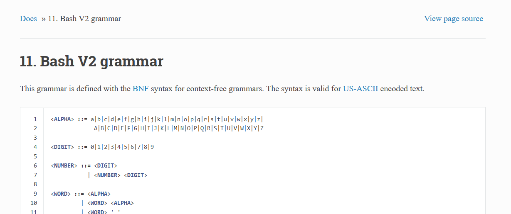
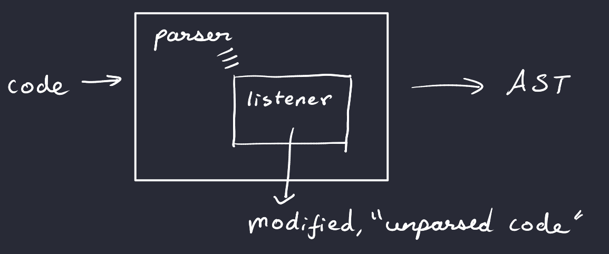

### Author

Ananth ("Ant") Srikanth [@Ant-28](https://github.com/Ant-28)

- [Introduction](#introduction)
- [Procedure](#procedure)
  - [Setting Up ANTLR4](#setting-up-antlr4)
  - [`ply`ing a grammar (no pun intended)](#plying-a-grammar-no-pun-intended)
    - [Wait. Isn't that the entire point of Bash? Spaces and tabs matter. A lot.](#wait-isnt-that-the-entire-point-of-bash-spaces-and-tabs-matter-a-lot)
  - [Back to grammars](#back-to-grammars)
  - [Eavesdropping is actually good! (not really)](#eavesdropping-is-actually-good-not-really)
- [Modifications](#modifications)
  - [Assignment](#assignment)
  - [Expressions](#expressions)
  - [Loops and double parsing woes](#loops-and-double-parsing-woes)
    - [Come again? Or don't.](#come-again-or-dont)
  - [More loops (and if)](#more-loops-and-if)
  - [Arrays and Ranges](#arrays-and-ranges)
- [Future Work](#future-work)
- [Conclusion](#conclusion)
- [References](#references)

## Introduction

Bash is ubiquitous with shell scripting, with some or the other form of the shell being an inextricable part of the command-line experience for users of UNIX(-like) systems. However, it is riddled with frustrating syntax and confusing shorthand that leaves people, more often than not, searching up how to write a specific command.
Furthermore, coming from most programming languages, Bash tends to introduce inconveniences (e.g. the fact that spaces are not allowed in an assignment statement, more on this later).

This does not mean Bash is outright awful. Piping syntax is easy to understand and familiarizing oneself with it doesn't take too long.

To solve these problems, I decided to parse bash's grammar and add rules to allow for rules that would be considered "more intuitive", coming from someone with greater familiarity with python or C. This project can take in a file in this "modified bash syntax" and spits out Bash that an interpreter can execute.

The source code can be found [here](https://github.com/Ant-28/NuShell).

## Procedure

To parse bash, I decided to use the Antlr4 parser generator. Why? Rather than writing a function for each grammar rule in `ply`, I only needed to write the grammar once in BNF form. Additionally, ANTLR supports loading in tokens using a token file, so tokens only need to be written down once. I decided to also use a Python backend since it was simpler than trying to set up ANTLR for Java or C++.



### Setting Up ANTLR4

After installing the ANTLR jar files, I added the following to my `.bashrc`:

```bash
# some more ls aliases
export CLASSPATH=".:/usr/local/lib/antlr-4.9.3-complete.jar:$CLASSPATH"
# simplify the use of the tool to generate lexer and parser
alias antlr4='java -Xmx500M -cp "/usr/local/lib/antlr-4.9.3-complete.jar:$CLASSPATH" org.antlr.v4.Tool'
# simplify the use of the tool to test the generated code
alias grun='java -Xmx500M -cp "/usr/local/lib/antlr-4.9.3-complete.jar:$CLASSPATH" org.antlr.v4.gui.TestRig'
```

This greatly simplifies ANTLR4 execution since `antlr4` needs to be called every time the lexer and parser are generated. However, this requires that the antlr jar be in one specific location.

### `ply`ing a grammar (no pun intended)

Now that ANTLR4 was set up and ready to go, it was time to find a grammar that could be used to parse Bash. I found not only one, but two different grammars! This made consolidating rules about the grammar easier to understand.
[The first grammar](https://cmdse.github.io/pages/appendix/bash-grammar.html) I found was in standard BNF form, angle brackets and all. I attempted to convert this to a grammar that ANTLR4 would accept, with little success when parsing.



My big break was when I found an alternate formal grammar [here](https://pubs.opengroup.org/onlinepubs/9699919799.2016edition/utilities/V3_chap02.html#tag_18_10). This also included separate rules for loops (for and while), as well as if statements, making it much easier to parse. After a bit of tweaking, I was able to create a parser file:

```antlr
program          : linebreak complete_commands linebreak
                 | linebreak
                 ;
complete_commands: complete_commands newline_list complete_command
                 |                                complete_command
                 ;
complete_command : nlist separator_op
                 | nlist
                 ;
nlist             : nlist separator_op and_or
                 |                   and_or
                 ;
```

Note that some production rules had to be modified, like the list keyword since `list` is also a keyword in Python.
Additionally, the grammar's tokens were very unclear, with `WORD` being defined by a set of long and complicated rules (this was renamed to `ID` for the sake of simplicity). When designing the lexer file, I decided to simplify the problem by ignoring spaces and tabs.

#### Wait. Isn't that the entire point of Bash? Spaces and tabs matter. A lot.

While that is true, the lexer only needs to store tokens separated by spaces and tabs. These spaces can be reintroduced when unparsing. My key takeaway from this was that spaces matter, but not the number of spaces.

### Back to grammars

After some testing and rule modification, the parser worked! However, it was missing some terms, such as the `case` keyword, which the first grammar contained. Adding that in provided more functionality.

I created a test file (with a great deal of guidance from tutorials such as [this one, check it out!](https://medium.com/@kv391/antlr4-grammar-a-quick-tutorial-e1f0fb6ca4ff)) to parse the grammar, and noticed that the tree ANTLR4 generates doesn't have a lot of information. It looks a lot like a Lisp Expression but doesn't store a lot of details on how to traverse parents:

```lisp
(program linebreak (complete_commands (complete_commands (complete_commands (complete_command (nlist (and_or (pipeline (pipe_sequence (command (simple_command (cmd_prefix (assign i = 0)))))))))) (newline_list \n) (complete_command (nlist (and_or (pipeline (pipe_sequence (command (compound_command (for_clause (custom_for_clause for i in range ( 1 , 2.5 , 3 ) (brace_group { (compound_list (linebreak (newline_list \n)) (term (and_or (pipeline (pipe_sequence (command (simple_command (cmd_name echo) (cmd_suffix (cmd_suffix_2 $i)))))))) (separator (newline_list \n))) }))))))))))) (newline_list (newline_list \n) \n) (complete_command (nlist (and_or (pipeline (pipe_sequence (command (simple_command (cmd_name echo) (cmd_suffix (cmd_suffix_2 $j)))))))))) linebreak)
```

This is when I stumbled upon the Parser Listener.

### Eavesdropping is actually good! (not really)

A Parser Listener is a class that one can instantiate to "listen to" an ANTLR parse tree while it is being generated. When it reaches a node of a specific type, a parser action can be executed and transform the tokens obtained by the lexer. This can be used to store traversed nodes and "unparse" a modified AST. We don't need to bother about tree traversals, as the listener traverses the tree as defined by the parser. We only need to bother about what the output should look like when unparsing a modified node, and ensure that unmodifed nodes return their original text.


This parser listener was then used alongside parser actions, leading us now to the actual modifications made to the grammar. Note that the parser listener has to be tied to the parser as follows:

```py
listener = MyCustomListener()
parser.addParseListener(listener)
```


## Modifications

### Assignment

This one's trivial, but requires understanding how ANTLR4 creates parser actions. For an assignment, it looks like this:

```ANTLR
assign returns [String result]: a=ID EQ b=(ID|NUMBER) {$result = $a.text + "=" + $b.text}
        | c=ID EQ  d=filename           {$result = $c.text +"=" + $d.result};
```

Note that assignments are supposed to be handled by the bash lexer, but due to the current implementation I decided to parse it at the grammar level instead.

A parser action is required to unparse assignments as unparsing, by default, inserts a space between all tokens, to
maintain functionality with bash. In the above example, the assign node returns a result value, which is either the text of the terms to the left of the = sign, or text and a result, since filenames are not IDs (IDs do not contain periods, but filenames do).

`{$result = $a.text + "=" + $b.text}`

This concatenates the grammar subrule `a` with the `=` sign and `b`. Parser actions also support conditional syntax, which is directly written in the Parser as python code.

Originally, the filename action looked like this:

```ANTLR
filename         : WORD;   
```

To account for token differences, this was modified to the following:

```ANTLR
filename returns [String result] : 
                   ID DOT b=filename? {$result = $ID.text + $DOT.text + $b.result if $b.result is not None else ""}
                 | DOT b=filename {$result = $DOT.text + $b.result if $b.result is not None else ""}
                 | ID {$result = $ID.text}
                          /* separate from IDs */
                 ;

```

This simplifies the parser listening to the following:

```py
    def enterAssign(self, ctx):
        result = None  
        ctx.result = result

    def exitAssign(self, ctx):
        self.statements.append(ctx.result)
```

parser listening requires a method of the form enterRule or exitRule, with the first character of the rule being uppercase (this is *very* important).

All statements are stored in a list called `statements` and unparsed by adding spaces in between each item.
This retains newlines as newlines are not ignored by the lexer (or the grammar, there's a production rule called `newline list` which is a very interesting design decision!)

Rather than diving through *all* of the code, I'll proceed with examples, and provide grammar / code wherever appropriate.
Let's see this in action:
This is the syntax of NuSh. If you've seen Bash, this shouldn't be too alien (barring the spaces in assignment)

```sh
i = 1
echo $i
```

This gets parsed as:

```sh
i=1 
 echo $i
```

(You can try this out in the repo by taking the first output and writing it to `foo.sh` and seeing what the resulting output is in `foo_bash.sh`)

### Expressions

This one's simple. Arithmetic expressions usually have to be enclosed in parantheses. Using some parser action magic
we see this

Sample Input:

```sh

i = 1493 + j + 12 * 5 / 3
echo $i
```

Output:

```sh

((i=1493+j+12*5/3)) 
 echo $i
```

Which, as expected returns 1513 (uninitialized variables are 0 by default).

The expression grammar doesn't need to encode precedence as the bash interpreter will handle that at runtime, making the grammar easier to write.

### Loops and double parsing woes

For loops are tricky. To see why, first let's define our syntax:

```ANTLR

for_clause       : custom_for_clause
                 | FOR name                                         do_or_brace
                 | FOR name                          sequential_sep do_or_brace
                 | FOR name linebreak (in_n | word)  sequential_sep do_or_brace
                 | FOR name linebreak (in_n | word)  wordlist  sequential_sep do_or_brace
                
                 ;
// this is my custom implementation                 
custom_for_clause returns [String result] : FOR LPAR for_assign SEMI for_comparison? SEMI for_loop_expr SEMI? RPAR (SEMI* | newline_list) brace_group
{$result = $FOR.text + "(( " + $for_assign.result + $SEMI.text + $for_comparison.text + $SEMI.text + $for_loop_expr.text + " ))\n" }
| FOR LPAR? ID IN array_items RPAR? (SEMI* | newline_list) brace_group {$result = $FOR.text + " " + $ID.text + " " + $IN.text + " " + $array_items.result + "\n"};

```

A for loop requires an assignment statment, a comparison and an expression. This has to be wrapped around double parantheses.
However, for_assign is also a custom rule that gets unparsed by the parse tree. The FOR node also tries to store its result to simplify the result string. So, who stores what? What if there's a nested for loop?

This is where the notion of an *ignorable parent* comes into play. 

#### Come again? Or don't.

If the for node stores the result of its children, and its children also store their result when being unparsed, there needs to be a way to tell the listener to ignore the child. This can be done by tracing the list of parents, and not unparsing if a parent is part of an ignorable parent list (predefined in the listener).

```py

    def generic_exit(self, ctx):
        # get the parent 
        parent_ctx = ctx.parentCtx
        context_type = None # predefine context_type for loop
        parentList = []
        
        # bubble up the tree
        # prevent double unparsing
        while parent_ctx != None:
            context_type = parent_ctx.getRuleIndex() # this is a number
            parentList.append(NewShParser.ruleNames[context_type]) # get the actual rule name
            
            if len(set(parentList).intersection(self.ignorable_parents)) > 0:
                return super().exitEveryRule(ctx) # default return
            parent_ctx = parent_ctx.parentCtx
        
        # print(ctx.result)
        self.statements.append(ctx.result) 
```

This prevents double unparsing and is called in child nodes as required.

### More loops (and if)

With that out of the way, we can see a small demo of for and while loops (they're both very similar to unparse, with the exception that while forces do .. done syntax when unparsed). If statements are similar, but need the `fi` keyword at the end.


Input:

```sh
for(i = 1; i < 65; i = i * 2){
    echo $i
    i = i + 1
    echo $i
}

j = 23
while(j > 0){
    j = j - 1
    echo $j
}

if(j == 0){
    echo $j
}
```

Output:

```sh
for(( i=1;i<65;i=i*2 ))
 { 
 echo $i 
 ((i=i+1)) 
 echo $i 
 } 
 
 j=23 
 while(( j>0 )) 
do
 
 ((j=j-1)) 
 echo $j 
 
done;
 
 
 if(( j==0 )) 
then
 { 
 echo $j 
 } 
fi

```

### Arrays and Ranges

The bash grammar that I used was from bash v2, but that didn't support arrays (at least in the grammar level),
So, I implemented them by hand:

```ANTLR
array_defn  returns [String result]: ID EQ array {$result = $ID.text + $EQ.text + $array.result};
array returns [String result] : LPAR wordlist? RPAR {$result = $LPAR.text + $wordlist.result + $RPAR.text};

array_ops returns [String result] :       array_length {$result = $array_length.result}
                | array_items {$result = $array_items.result};

array_length returns [String result] : a=(ID|VAR) DOT LEN LPAR RPAR {$result = "${#" + ($a.text if $a.text[0] != '$' else $a.text[1:]) + "[@]" + "}"};
array_items  returns [String result] : a=(ID|VAR) DOT ITEMS LPAR RPAR {$result = "${" + ($a.text if $a.text[0] != '$' else $a.text[1:]) + "[@]" + "}"};

```

Arrays can now be defined, and their length / items can be accessesed using the .length() / .len() and .items() keywords, respectively (note that there are two versions of array_items, one with for as an ignorable parent and one without):

```sh
a = (1 2 3 4)

echo a.len()

echo a.items()

for i in a.items() {
    echo $i
    echo $a.items()
    echo $a.len()
}
```

```sh
a=(1 2 3 4) 
 
 echo ${#a[@]} 
 
 echo ${a[@]} 
 
 for i in ${a[@]}
 { 
 echo $i 
 echo ${a[@]} 
 echo ${#a[@]} 
 }
```

As can be seen, NuSh is far more readable and intuitive at first glance than Bash.

Finally, I added a `range` keyword, based on the bash implementation of `seq`, so bounds are inclusive. This also provides rudimentary floating point ranges to bash, which doesn't support floats. The `range` keyword is only supported in for loops, much like python:

This is what it looks like:

```sh
for i in range(1, 1.5, 10){
    echo $i
}
```
Output:

```sh
for i in $(seq 1 1.5 10 )
 { 
 echo $i 
 }
```

As expected, this returns a sequence of floats:

```sh
./foo_bash.sh 
1.0
2.5
4.0
5.5
7.0
8.5
10.0
```

## Future Work

Creating a `FLOAT` token for the range keyword is finicky since it can conflict with filenames, so that is something I plan to implement advanced floating point support, leveraging the `bc` command. 
Additionally, I plan to create a custom lexer that's closer to bash's lexing rules, as seen [here](https://pubs.opengroup.org/onlinepubs/9699919799.2016edition/utilities/V3_chap02.html#tag_18_03). This also explains how strings are defined, which I would like to add to my grammar (strings are very finicky and could break IDs, if not implemented properly).
Furthermore, the grammar does not support many conditions that bash does, such as test conditions in double square brackets. Additionally, consolidating ignorable parents (or finding an alternate approach to fixing double unparsing) is next on the list. 

## Conclusion

Bash is muddled with arcane syntax. From the aforementioned examples, NuShell attempts to fix that, but has a long way to go. Ideally, I would like to end up with a whole new shell that supports interoperability with bash. 


## References 

Bash Grammars:
[Grammar 1](https://cmdse.github.io/pages/appendix/bash-grammar.html)
[Grammar 2](https://pubs.opengroup.org/onlinepubs/9699919799.2016edition/utilities/V3_chap02.html#tag_18_10)

ANTLR Tutorials
The main ANTLR code that parses the tree (but not the grammar itself) was copied from [this blog post](https://jason.whitehorn.us/blog/2021/02/08/getting-started-with-antlr-for-python/)
Thses tutorials are also great!
- [ANTLR4 Grammar: A Quick Tutorial](https://medium.com/@kv391/antlr4-grammar-a-quick-tutorial-e1f0fb6ca4ff)
- [Introduction to ANTLR](https://faun.pub/introduction-to-antlr-python-af8a3c603d23)
- [The ANTLR Mega Tutorial](https://tomassetti.me/antlr-mega-tutorial/)


- Some guidance on how to write listeners was provided by [ChatGPT](https://chat.openai.com/)
- The rest was based on [ANTLR documentation](https://www.antlr.org/)